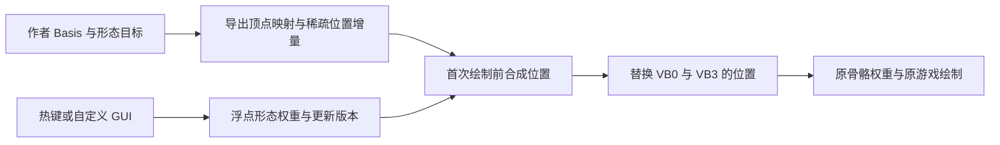

# EFMI 体型滑条：真实样本与上游执行路径

2026-10-02。只读研究，没有运行 Mod、修改源包、部署游戏或生成模型产物；没有计算产物哈希。上游 commit 仅用于固定引用版本。

## 已确认的结论

EFMI 有现成的连续形态控制机制：**作者在 Blender 做形态目标，导出稀疏顶点位置增量；INI 热键/GUI 改浮点权重；固定 compute shader 在绘制前把增量加回原始顶点位置；随后继续使用原游戏的蒙皮和绘制路径。** 这既不是循环切换几个完整模型，也不是缩放角色骨骼，更不依赖 Unity 的 BlendShape API。

官方 [Shape Keys Guide](https://github.com/SpectrumQT/EFMI-Tools/blob/eaa903624529e4cff93fa5c6cf999b3d44d40eff/guides/shape_keys_guide.md#L1) 明确注明 **EFMI v1.3.0+** 支持，并把体型调整、热键和自定义 GUI 滑条列为用途。这里的 EFMI 版本与拟议的 BEM 1.3 是两个不同版本体系。作者提供的公开示例是陈千语角部形态的连续动画；本轮没有把该示例当作所有体型包的游戏内效果验收。

重要修正：[上一轮 BEM 1.3 提案](../../bem-1.3/BEM_1_3_BODY_SLIDER_DESIGN.md) 将打包方向 codec 视为正式连续控制的前置门槛，表述偏严。**匹配 EFMI 现有能力只需要位置增量；其官方 morph shader 本身也保留原法线/切线。** 方向重建应作为改善大幅塑形光照的可选扩展，不能因此推迟位置滑条。

## 本地真实包检查范围

从用户已有 Downloads/Compressed 读取 7 份归档，其中 5 份含模型 INI/HLSL，共 **15 份文本**。只保存文本分析副本与列表，未提取模型/贴图 payload：`artifacts/efmi-body-slider-research-20261002/local-samples/scan.json`。研究副本换行已规范化，以下行号对应源文本的原始逻辑行。

| 现有包 | 证据与行号 | 实际机制 |
| --- | --- | --- |
| `endmin_in_casualwear.zip` | `endmin in casualwear/mod.ini:7`、`:10`、`:11`；副本 `endmin_in_casualwear_zip-53-mod.ini` | `KeySwapMask` 的 cycle 在 -1/0 之间切换；`:104`、`:105` 控制面罩 draw。是离散可见性，不是体型插值 |
| `061fe0a00d2904dd90ab25441e5c8f06.rar`（庄方怡） | `庄方怡/庄方怡.ini:4`、`:8`、`:9`；副本 `061fe0a00d2904dd90ab25441e5c8f06_rar-46-庄方怡.ini` | 热键在 0/1/2 档间切换，不是连续形态 |
| `gilberta_12.rar` | `洁尔配塔.ini:504` 起的 KeySwap；`res_ini/洁尔配塔_panel.ini:71`、`:85`、`:99`、`:189`；副本分别带前缀 `gilberta_12_rar-78-`、`-37-` | GUI 有鼠标按住、坐标和拖拽处理，但点击修改的是部件/服装开关；菜单尺寸/位置变量不能当作体型滑条 |
| 同一洁尔佩塔包 | `res/record_bones_cs.hlsl:4`、`:24`、`:25`；副本 `gilberta_12_rar-35-record_bones_cs.hlsl` | 把原骨骼数据复制到另一缓冲区，没有按滑条修改骨矩阵；出现 compute shader 不代表是体型形变 |
| `mod_7b260.zip`、`laevatain-cheshire_slot15.7z` | 扫描各自 2/3 份 INI | 未发现标准 ShapeKeys 调用/资源 |

另外两份归档没有 INI/HLSL。以上本地样本中未发现标准形态 buffers，因此**不声称已经在本机找到了并验证了某个体型滑条包**；连续机制的完整证据来自下面的作者维护源码，而非对 cycle/GUI 的猜测。

## 上游完整链路

固定版本：EFMI-Tools `eaa903624529e4cff93fa5c6cf999b3d44d40eff`；EFMI-Package `3d40c54ba86fdfd0e26d8ccbbd3848632f063b06`；XXMI-Libs-Package `34fa32fab97b828319f01a0af29ba36228c6d12e`。原始公开源码只保存在忽略的研究目录 `artifacts/efmi-body-slider-research-20261002/upstream/`，没有加入工具分发。

1. **Blender → delta buffers。** 读取目标坐标减 Basis，再用最终导出 `vertex_ids` 映射，因此 UV/法线拆点后的顶点仍对应正确位置。仅非零增量的顶点进入稀疏列表，每批处理 127 个形态；输出 batch configs、UInt32 顶点 ID 和 FP16 XYZ 增量，镜像/旋转/单位转换沿导出流程处理。参见 [shape key builder](https://github.com/SpectrumQT/EFMI-Tools/blob/eaa903624529e4cff93fa5c6cf999b3d44d40eff/efmi-tools/migoto_io/data_model/shapekeys.py#L28)（`:28`、`:41`、`:81`、`:165`）、[data model](https://github.com/SpectrumQT/EFMI-Tools/blob/eaa903624529e4cff93fa5c6cf999b3d44d40eff/efmi-tools/migoto_io/data_model/data_model.py#L938)（`:961`、`:970`）。

2. **输入 → float weight。** 按键的 cycle 可以仅提供几个离散值；真正的连续滑条由作者 GUI 把鼠标位置映射为浮点参数，再调用同一 SetShapeKey 接口。官方指南明确允许这一输入方式，但没有给所有 Mod 规定一套通用滑条 UI。XXMI 的 INI 表达式有窗口像素与 normalized cursor 坐标，按键有 hold/cycle 类型。参见 [输入/参数实现](https://github.com/SpectrumQT/XXMI-Libs-Package/blob/34fa32fab97b828319f01a0af29ba36228c6d12e/DirectX11/CommandList.cpp#L3824)、[按键解析](https://github.com/SpectrumQT/XXMI-Libs-Package/blob/34fa32fab97b828319f01a0af29ba36228c6d12e/DirectX11/IniHandler.cpp#L1655)。坐标转权重是 GUI 逻辑，不是形态算法。

3. **SetShapeKey → dirty version。** 自动生成模板按 component + shape ID 保存上次值，仅变化时写 GPU 权重 buffer 并标记更新版本；多个设置调用只形成待处理状态。参见 [mod template](https://github.com/SpectrumQT/EFMI-Tools/blob/eaa903624529e4cff93fa5c6cf999b3d44d40eff/efmi-tools/templates/mod.ini.j2#L532)（`:534`、`:535`、`:544`、`:546`）。[setter shader](https://github.com/SpectrumQT/EFMI-Package/blob/3d40c54ba86fdfd0e26d8ccbbd3848632f063b06/EFMI/Core/EFMI/Shaders/SkapeKeySetter.hlsl#L23) 只写浮点权重，不在此时重建整个网格。

4. **dirty → lazy position morph。** 组件首次需要绘制时检查版本；清空临时整数累加区，逐批执行 loader，再 dequantize 加回不可变 base position。已有该版结果的其他 LOD 会复用/复制位置，而不是重复计算；没有参数改变时不重跑形态合成。参见 [ShapeKeys.ini](https://github.com/SpectrumQT/EFMI-Package/blob/3d40c54ba86fdfd0e26d8ccbbd3848632f063b06/EFMI/Core/EFMI/ShapeKeys.ini#L92)（`:94`、`:120`、`:139`、`:158`、`:173`）。

5. **compute 合成。** [loader](https://github.com/SpectrumQT/EFMI-Package/blob/3d40c54ba86fdfd0e26d8ccbbd3848632f063b06/EFMI/Core/EFMI/Shaders/ShapeKeyLoader.hlsl#L105) 读取顶点 ID、增量和 weight，用整数原子累加避免并发写同一顶点的冲突。[dequantizer](https://github.com/SpectrumQT/EFMI-Package/blob/3d40c54ba86fdfd0e26d8ccbbd3848632f063b06/EFMI/Core/EFMI/Shaders/ShapeKeyDequantizer.hlsl#L42) 将累计值还原，只写 position XYZ；支持不同 VB stride。CPU 不需要每次读回 GPU 位置。

6. **morphed VB → 原绘制/蒙皮。** 模板先完整复制原 VB0 保存 TBN 等其余字段，再把形态结果接到 VB0/VB3；VB1、VB2 权重和材质照常选择，最后 drawindexed 或 instanced draw。参见模板 [`:222`](https://github.com/SpectrumQT/EFMI-Tools/blob/eaa903624529e4cff93fa5c6cf999b3d44d40eff/efmi-tools/templates/mod.ini.j2#L222)、`:235`、`:236`、`:271`、`:289`、`:580`。XXMI CustomShader 执行完会恢复 shader 状态，因此形态 compute 不是把游戏绘制 shader 永久替换成自己的蒙皮器，参见 [shader state restoration](https://github.com/SpectrumQT/XXMI-Libs-Package/blob/34fa32fab97b828319f01a0af29ba36228c6d12e/DirectX11/CommandList.cpp#L2879)。模板对 CPU-posed 组件单独保留原网格，不把此 GPU 路径声明成所有组件都通用。

算法等价于 `position = basis + Σ(weight × author_delta)`。没有修改 skeleton rest transforms、bindpose 或 skin weights；身体和衣服能否配合，取决于作者是否给两者提供相容形态。

## 它没有解决哪些事

- **骨骼缩放不是上述链路。** 骨骼复制/合并用于提供蒙皮 palette；只有另写修改矩阵的程序才属于骨骼比例控制。本轮标准形态 shaders 没有这一步。
- **表面方向沿用 base。** runtime loader/dequantizer 不更新法线、切线或 bitangent sign。EFMI exporter 另有 [10/10/10/2 TBN 编解码](https://github.com/SpectrumQT/EFMI-Tools/blob/eaa903624529e4cff93fa5c6cf999b3d44d40eff/efmi-tools/data_models/data_model_efmi.py#L312)，但不能据此说形态 runtime 已重新算 TBN。大幅形变仍可能出现光照、轮廓和衣服问题。
- **任意范围不是免费能力。** 导出量化尺度按所有 weight 在 0..1 推导；setter 本身没有替作者定义美术范围。超范围控制需要重新界定累计值/精度，不能照抄尺度后承诺无限外推。参见 [量化计算](https://github.com/SpectrumQT/EFMI-Tools/blob/eaa903624529e4cff93fa5c6cf999b3d44d40eff/efmi-tools/migoto_io/data_model/shapekeys.py#L123)。
- **没有本轮性能实测。** 变化触发、首次绘制计算、LOD 复用是代码确认的优化；真实成本仍取决于稀疏条目数、受影响顶点数、批数及硬件，不能把“127 个形态同批”解释为任意形态数量都没有额外开销。

## BEM 可以直接借用的部分

最有价值的是 **作者 target、最终顶点映射、稀疏 delta、连续权重、dirty 世代及复用 base 的合成模型**。导入标准 EFMI buffers 时可把 FP16 增量解为 BEM 自己的明确编码；维持相同单位/轴向，neutral 时复原 base。已有完整形态数据不必为每个滑条档位保存一个完整模型。

为了复现 EFMI 的现有视觉语义，BEM 首版可保留原 TBN，不要求新 shader 或新方向 codec：用包内 CPU base/delta，只在值变化时合成位置，再交给现有双端 Mesh 上传和骨骼绑定。若要游戏内实时拖动，需要在 Unity 主线程上增加合并输入/更新位置的运行后端；现有“下次资源交付”热切换只能实现参数保存后随普通刷新应用，不能自动变成实时预览。

若以后移植 GPU 后端，需要 Windows 与 Android 各自可用的固定受控 compute kernel、可写 mesh buffer、同步/世代/回退管理。EFMI 的 D3D11 INI 绑定和 UAV 不能直接在 Android 使用；没必要把任意 Mod HLSL/INI 作为 BEM 执行格式。这部分本轮没有实现或验证。

自动转换宜先覆盖官方生成的 ShapeKeys 三类 buffers 与 SetShapeKey 映射；**有形态 buffers 不等于自动知道滑条名字、默认值、范围和 GUI 算式**。标准绑定可转换成声明式参数；作者自定义 GUI、时间动画、任意数学表达式或 shader 仍需要人工适配。没有 target 的原版模型不能仅依靠骨骼名称自动获得体型轴。

因此建议调整优先级：直接以 **EFMI 同款位置 morph** 做 BEM 1.3 的小范围原型；方向重建作为可选质量增强；完整预烘焙档位只作为无法取得形态增量时的备选。正式双端支持仍须同时补 Python/原生解析、Android 安装保留 payload、UI 参数持久化、cache key 和实例/资源世代处理。
