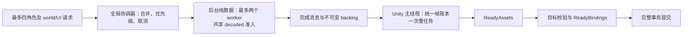

# 最多四角色的全局模型加载队列设计（2026-10-03）

建议采用**一个全局协调器、最多两个后台解压 worker、一个 Unity 主线程预算账本**。当前可见/选中角色优先，另三角色按任务单元轮转预热；相同角色、包版本和选择的 world/UI 请求合并纯数据准备，兼容的成品继续走联合事务。四角色各自开启异步任务、各自设置每帧预算，会让解压和上传重新叠加，不满足降瞬时峰值的目标。

首次交付优先采用 **Ready 提前准备 + 未准备好时正常交付原版**。必须首次显示即替换的严格延迟策略单独验证，不能在 `_FinishWithAsset` / `ResourceFinish` 内等待下一帧。单张 64 MiB `Apply` 仍可能超过软 2 ms；本设计限制提交密度，不能保证真实 GPU 在途上限，也不能消除四套纹理约 1.45 GiB 的最终容量。

本任务 B 仅新增本文。基线为 `main dd7131b4` 加已有未提交改动；已读取仓库唯一检出的 `android/AGENTS.md`，以及下列既有研究。没有修改生产代码、配置、其他研究文档或 UI，没有构建、安装、启动游戏、新抓手机日志或重新反汇编 DLL。没有全量提取、复制或 clean 外置硬盘，也没有重跑上一轮测试。后文数字是待验证的调度起点，阶段表是后续实施/验收方案，不代表本轮已经实现。

## 1. 已有依据和本设计的边界

| 依据 | 可以采用的结论 | 不能据此保证的内容 |
|---|---|---|
| [原生加载研究](NATIVE_MODEL_LOADING_RESEARCH.md)：现有手机日志 3438、3561、3619 行 | 每个独立事务各有 8 次 Texture 构造/Apply、387,856,640 B（369.89 MiB）纹理请求、12,294,548 B Mesh 请求；最大单张 64 MiB，实际为 8K ASTC、单 mip | 850–1637 ms 是事务总耗时，没有逐调用计时；三次不能相加解释用户观察的一次约 0.9GB 瞬时上涨 |
| 同一研究的 PC 静态链路 | `UpdateLoading` 在 `_FinishWithAsset` 后继续 `_OnAsyncCompleted`；原生存在异步资源请求、优先级和下一帧通知队列 | Android ABI/IFix 顺序、当前调度并发、实际 Unity async upload 路径、可多帧扣住完成的状态机尚未证实 |
| [上传峰值研究](MODEL_UPLOAD_PEAK_REVIEW.md) | 初次 world 内 paired UI 重复上传已修；后续独立 UI 仍有重建记录；统计的是 API 请求字节 | 请求字节不是驱动 residency/staging，CPU 解压节省不能替代单次 GPU 峰值验收 |
| [热切换研究](../hot-switch/HOT_SWITCH_LEGACY_PATH_RESEARCH.md) | pristine donor、实例骨骼、生成代次和消费者寿命要分别维护；新 root 不一定命中现成资产 | 相同角色或包名不能证明 donor 兼容；弱记录、GCHandle free、固定等两帧都不证明 GPU 已回收 |
| [世界绑定记录](../matching-identity/WORLD_MODEL_BINDING.md) | Android world/UI 复用有现成适配与联合提交/回滚基础，Renderer 与 Mesh 身份须分别精确验证 | 不能放宽 Mesh 名、骨骼、LOD、材质或 source Texture 身份来获得跨请求命中 |

本轮只在当前源码定点核对方案衔接处：`module.cpp` 的 `ConstructionScope`（约 350 行）、`PrepareResource`（1906）、`AcquirePayload`（2575）、`ProcessResource`（2755）、`ResourceFinish`（2881）和 `ResourcePump`（2904）；`bem.cpp` 的 `Payload/TakePayload`（380/415）；`mod_registry.cpp` 的 selection key（99–106）；Android `world_resource_adapter.inc::PrepareAndroidWorldResource` 与 `android_mesh_builder.cpp::AndroidLoadUiDonor`。工作区并行变化时行号可能移动，函数名为复核入口。没有重新推导纹理创建 flags 或搬用 PC RVA。

尤其要区分：当前 `AcquirePayload` 的 **128 MiB/10秒缓存只限制缓存表**；大包不入缓存也能返回完整 `BemPocData`。多个请求正在持有的 payload、解析临时副本及解压中的输出并不都在该表预算内。`bem.cpp` 的格式/选中数据校验预算也不是四角色运行中总驻留预算。仅把现有 `LoadBem` 放到四个线程，不能得到本设计的全局上限。

## 2. 一个协调器，三层身份

设计中的类型/状态名均为拟议接口。`TeamSnapshot` 提供最多四个 role ID、当前控制/可见角色、详情页选中角色和 `teamEpoch`。当前源码和既有研究**没有证明能取得完整配队快照或所有实例生命周期通知**；后续先定点确认入口。在入口未确认时，只能为已经观察到的角色请求排队，不能声称已提前预热另三角色，也不扫描全部启用模型冒充配队。

| 身份 | 用途及最少字段 |
|---|---|
| `SelectionKey` | 合并逻辑 Job：平台/资源构建身份、role、规范化 package 身份、不可变 revision、外观/options、规范化 parameters、校验/优化模式、adapter/catalog 版本。world/UI 类别和具体 root 不放进此 key，而作为订阅者/子计划 |
| `PayloadKey` | 合并同包同 revision 的原始解压块：payload ID、codec、声明 decoded size 和适用校验身份。派生几何/参数运算另按 selection 区分；不同 texture 条目共用 payload 不等于共用 Unity Texture |
| `TargetKey` / 兼容资产身份 | 区分 world/UI、root/实例代际、native-live donor 身份及布局、bindpose/palette、shader/材质/贴图槽、色彩空间和 sampler 等兼容信息。具体 bones 属于接收者实例，不能从 UI root 原样套给 world |

`teamEpoch`、每角色 `selectionGeneration` 和 target generation 是提交时效条件，不并入不可变内容 key。仅优先级变化或 A→B→A 重新订阅仍有效的同版本内容时，不必重新解压；内容失效、取消清理已开始或 native 对象失活时必须重新准备。现有 PC 时间/大小 key 不是内容摘要：未建立不可变 revision/文件 lease 前，不跨可变文件代次宣称安全复用；无需为此扫描或哈希整盘/全包。

一个 `RoleJob` 保存 selection 快照、adapter ownership、文件 lease、纯数据计划、进度和订阅者集合。同一 key 的 world-first、UI-first、重复打开 UI 只增加需求，不各自启动完整解压/上传。world/UI 若 donor/布局不同，仍可共享纯数据，生成资产和绑定分别验证；不兼容的子计划允许独立构建，记录原因。

最多四个配队角色是**推测预热集合上限**，不是强制同时创建四套资源。额外详情页的真实请求也共用此队列并挤占预热名额；容量不足时停止低优先级预热，游戏请求仍正常交付原版。没有真实消费者的历史 revision 不长期占队列，不能按所有启用包不断增加预热 Job。

## 3. 后台解压：并发和总 decoded 同时准入

后台只做文件/metadata 读取、Zstd、纯数据计划、计数和校验，不查询或操作 Unity 对象。主线程接受不可变完成消息；workers 不拿 `g_state_mutex` 等待主线程，不等待下一帧，不持有 Unity 裸指针调用 IL2CPP。线程 attach 不等于 Unity 主线程许可。

| 项目 | 建议初始值/规则 | 范围 |
|---|---|---|
| 解压并发 | 全局最多 2 个 worker；2 是上限，受内存准入后实际可为 0/1 | 所有角色、world/UI 和候选 revision 共用 |
| 总 decoded 预算 | 256 MiB | 解压中已预留输出、已解压待消费、派生纯数据和闲置缓存仍持有的唯一 backing 全部计入 |
| 闲置 decoded 缓存 | 最多 64 MiB、10秒 TTL，包含在 256 MiB 内 | 无消费者才可 LRU 驱逐；不另叠加现有 128 MiB 缓存 |
| 前台准入保留 | 起步留 64 MiB 给当前可见/选中角色下一单元 | 其他预热最多占 192 MiB；若前台声明的单元更大，先扩大保留区并减少预热额度，不增加总预算 |
| 预读深度 | 每个非前台角色最多一个待消费数据单元；所有角色仍受总预算 | 不一次解压四份完整 `BemPocData`；前台可利用剩余额度，但不得占掉应获公平服务的全部空间 |

预算不变量为 `liveDecoded + reservedDecoded <= 256 MiB`。已申请但未分配的输出占 reserved；分配/完成时原子转为 live，不再次扣一份。shared backing 按实际持有的分配容量计一次，切片不能按视图长度少计；复制/变形输出在分配**之前**独立预留。移出缓存但仍被 Job/消费者持有的数据仍计 live，取消正在解压的任务也不能提前退还其输出预留。

压缩输入、Zstd workspace、JSON/计划、Unity 可读存储和游戏原资源分别记账；256 MiB 不是整个进程 CPU 或统一内存的硬上限。实现时还需限制读缓冲和 Zstd window/工作区，避免存储层或 decoder 暗中整块读入；没有这些观测就只报告 decoded 上限。

**必须拆分读取/解压与最终结构组装。** 先从 header/manifest/directory 得到选中 payload 使用关系和预计大小，再按纹理 payload 或一个组件必需的几何组申请额度、解压、消费和释放。现有 monolithic `LoadBem/Decode` 仍积累完整输出，不能直接套上 256 MiB 后假装可处理约 370 MiB 纹理的包；本阶段拆分需保持原有格式、引用、参数、选择与校验语义。

共享 payload 的最后消费者结束后释放；尚有未来消费者时可保留或按不可变文件再次解压，采用有界缓存而非强制永久保留。传给 raw/Mesh API 的 backing 必须保持到已确认的复制/读取完成边界，不能仅因调用已入队就释放；Unity 另建的可读副本独立计量。解压队列优先为主线程下一单元供数，避免三个预热结果占满空间而前台缺数据。额度不足只让后台进入 `WaitBudget`，不会阻塞 Finish hook。若单 payload 或不可拆几何组超过总预算，返回明确的内部失败/原版退路，不能永久等待、不记录地突破上限或偷偷降分辨率。

解压输出小于声明、校验失败、文件 lease 失效、取消后的晚到结果都不得进入可提交计划。释放额度后唤醒下一个可准入请求；失败/取消消息不触发自动无限重试。

## 4. Unity 主线程：所有角色共用每帧账本

队列拟接现有 `ResourcePump`，但先确认对象调用的 Unity 主线程和可用 tick。Canvas 回调可能同一帧重复，也可能某场景没有回调：以已验证的帧号去重，共享账本只重置一次；没有 tick 时允许加载变慢或暂用原版，不在同步 Finish 栈内反复 pump。后台完成、Ready 发布、清理和 Finish 消费都使用同一账本，不能每进入一个角色/回调就重新获得预算。Finish 若不在已确认的 Unity 主线程，仅通知协调器并继续游戏原链，不在该线程查询/绑定 Ready 对象。

| 预算 | 建议初始值 | 执行规则 |
|---|---:|---|
| Texture Apply + Mesh 提交输入字节 | 32 MiB/帧 | 四角色合计；只统计真正执行的请求，包括之后失败/取消的提交。不是 GPU residency |
| Raw copy 输入字节 | 32 MiB/帧 | 与上传分别计，防止拆开 Apply 后同帧复制四套纹理；同一数据 copy 与 Apply 的计数不合并冒充唯一资源容量 |
| 对象创建/销毁 | 8 次/帧 | Texture、Mesh、Material 和必要临时对象及取消清理共用；未知/不可分割大单元走显式独占例外 |
| 重任务 | 最多 1 次/帧 | Texture ctor、raw copy、Apply、不可分割 Mesh builder、整批 Commit/恢复等占重任务许可；角色之间不能各做一次 |
| 新 Texture / 未完成 Texture 链 | 新建最多 1 个/帧；全局最多 1 条 ctor→raw→Apply 链 | 不先创建四角色所有空 Texture。构造、raw、Apply 可在不同帧；链结束/取消后才轮转重任务 owner |
| 主线程时间 | 软 2 ms/帧 | 调用前看已用时间，调用后记录实际耗时，达到预算不再开始新步骤；不是可中断期限 |

普通单元只有在字节、对象、重任务许可和剩余软时间允许时才运行。一个 Texture 单元的三步完成前持有重任务 owner；其他 Job 的后台准备仍可继续。链的后续 raw 数据必须已准入/可到达，不能拿着空 Texture 许可等永远无法分配的 payload。Mesh/材质/目标校验拆到可恢复的组件边界，不改资源语义。

**大单元逃生规则不可省略。** 64 MiB raw 或 Apply 大于 32 MiB，永远等额度会饿死。只有当帧没有其他重任务时，允许单个合法超额单元独占，并记录 `oversize`、实际字节和耗时；之后停止该帧额外创建/上传。ctor 的初始化/默认上传成本未知，另记预估容量和实测 ctor 时间，不把预估写成实际 GPU 上传。单个不可切 Mesh、原子 Commit、失败恢复也可能超软预算，必须独占并计量。

初始可在大 Apply 后留两个不同帧号的 pump 帧不给新上传，缓和提交密度；这是保守启发式，帧号前进不是 GPU 已完成。记录 recent submitted bytes/帧和冷却原因，**不将其命名为真实 GPU 在途字节**。没有可等待的上传 token/fence 或驱动时间线时，不能报告硬在途上限，32 MiB/帧也不能保证一个 64 MiB Apply 小于 2 ms。

完整提交保持一次 world/UI 联合事务与失败逆序恢复，不能把一半绑定发布给游戏、下一帧再补另一半。提交前做好目标读取和校验，尽量减少最后阶段的调用；Commit 仍属不可分割重任务，预算不足就留到下帧。Ready 结果若在同步 Finish 中无法满足当帧许可，则按首次交付策略继续原版，不阻塞游戏等待额度。

Unity 对象销毁、loader handle Dispose、取消清理也在主线程预算内逐批执行。失败恢复优先保障已发布对象的一致性，可能超软时间时记录例外，不能为追求 2 ms 延迟必要回滚。不得通过 `GC`、第二次 Apply 或 `UnloadUnusedAssets` 替代账本/上传节流。

## 5. 前台优先、另三角色预热与公平性

优先级采用可更新需求，不能在 Job 创建时永久固定：

1. 当前控制/实际可见且有交付需求的 world 角色，以及当前选中详情 UI；两者同时需要时同级轮转，按实际交付需求选择先后。
2. 其他已有可见消费者的角色。
3. 队内另三角色的推测预热。先做计划与 donor 准备，再用剩余额度逐步生成资源；不预热队外全部包。

在**已就绪且可准入**的任务中，以一条完整 Texture 链或一个组件重单元为服务量子；每完成四个量子，至少一个机会给等待的非前台角色，非前台之间按 round-robin。后台解压按同样 3:1 机会规则提供数据。空配额可借给前台；冷却、缺 donor、缺数据或总预算不足时不忙等，也不把一个不可运行任务当成已获服务。

稳定队伍最多三个非前台、各自持续可运行时，每个至少在十二个完成量子内获一次服务；这是**调度机会界限，不是十二帧/毫秒或 Ready 完成期限**。单 Texture 的三步及冷却可占多个帧。等待满 120 个实际 pump 帧的可运行任务提升到下一个公平机会，保留其年龄，避免反复 UI 请求把等待归零。前台额度保留区不能吞掉公平量子所需的全部内存：到公平机会时先停预读、释放可驱逐缓存，等已消费数据释放额度后再准入。

若高优先级任务本身需要整个 decoded 预算，低优先级须等待其释放；若游戏内存压力不允许继续生成预热资产，应暂停推测预热并记录原因。预算不允许进展、donor 永久缺失、不断换队造成取消时，公平性不能保证完成；超时后让消费者走原版退路，而不是不断提升优先级加重内存峰值。

首版不额外强持有多代闲置 Ready 成品。配队三角色可以逐步生成并保留当前代准备结果，但生成预算必须与旧代/已发布消费者分开观察；选择降低推测预热深度时允许其只达到 Plan/Decoded，而非承诺四角色全部常驻 Ready。

## 6. Ready、取消和跨帧所有权

拟议状态为 `Queued → Plan → WaitBudget/Decode → WaitDonor → Build → Validate → ReadyAssets → ReadyBindings → Commit`，等待状态可交错；任一未发布阶段都可转 `CancelRequested → Cleanup → Cancelled`，失败转 `Cleanup → Failed`。它们不是单次函数内跑完的循环。

- `ReadyAssets`：已生成且验证了可共享的 Mesh/Texture 等资产，尚不保证某个新 world/UI root 的 renderer、骨骼及 donor 兼容。
- `ReadyBindings`：特定 TargetKey 的布局/骨骼/材质/阴影等已验证、回滚快照有效，完整事务可以提交。晚来的目标仍可能需要主线程增量校验；Finish 不能把任意 ReadyAssets 当成即刻可绑定。
- `Commit`：再次检查 selection/revision、target 存活与当前绑定，联合事务一次发布。某个角色 Ready 不必等待全队 Ready；每角色完整发布，四角色逐步完成。

持久 Job owner 保存纯数据 backing、adapter/registry shared ownership、selection/target generation、游戏资源 tracked handle/lease、Unity 强 roots、生成对象归属和阶段计数。**不能把当前栈上的 `ConstructionScope` 或 `g_construction` 指针跨帧保存。** 后续需任务资产 owner 与短时执行 scope 转移所有权，成功/失败/取消都有明确归属；GC root 不能替代游戏 bundle/asset 的 retain 或 native-live 检查。

快速换队/改包先由主线程原子接受新快照：未变的 role/key/target 订阅转到新 epoch 并保留进度，离队、改 key 或失活的旧订阅者才标记失效。同 key 的新订阅与旧订阅解除一起处理，避免短暂零消费者误取消共享 Job：

1. 尚未开始的旧量子移出队列；可重用的同 key 数据保留在有界缓存，无消费者的旧生成任务取消。world/UI 订阅者分别移除，取消 UI 不能连带取消仍有 world 消费者的共享 Job。
2. 已执行的 Zstd/Unity 不可中断调用允许返回。每次分配/调用前、后台消息入队后以及提交前重新核对取消标记；晚到结果不发布。原有已显示模型继续可用，尚未发布的替代不覆盖它。
3. worker 结束且 backing 释放后才归还相应 live/reserved 额度。Unity 未发布对象由主线程清理队列处理；未完成清理继续计数，不在后台 Destroy 或提前报告释放。
4. 已发布资产仍被其他 world/UI、模板/实例使用时，不随换队销毁。仅对本 Job 独占且未发布对象清理；发布代次的退休沿消费者账本验证，不能回滚或销毁其他任务/原版资产。

A→B→A 时，可重新订阅尚存且未进入销毁流程的同 revision 结果；清理已开始则创建新 Job。无法硬取消已经开始的 64 MiB Apply，也不能保证快速换队马上把其 driver staging 取回。必须记录 cancelled-after-submit 字节，避免只统计最终 Commit 的成功事务掩盖浪费。

## 7. 首次同步交付和 donor 防死锁

现有 Finish hook 最后会调用原 finish，PC 普通 `UpdateLoading` 紧接着安排完成通知。**在 hook 内等待下一帧会阻塞帧泵；存下参数直接返回又可能让后续通知先于有效 asset/status。** mutex、条件变量、sleep、循环调用 pump、四个线程等待或把 Unity 创建放到后台，都不能解决这一交付契约。

建议首阶段行为：在已确认的模型选择/配队变化/已知资源请求入口提前 enqueue。Finish 遇到匹配 `ReadyBindings` 且当帧允许完整提交时，只消费已准备事务并正常继续原链一次；未 Ready、校验失败、额度不足或同步强制完成时，**正常交付原版并保留当前代加载需求**。不把旧包半成品交付给游戏，不回到原同步全量构建作为降峰退路。

Ready 后替换已经显示的对象，需要热切换研究中的**已验证目标登记与 live renderer 重绑事务**；修改已交付 prefab 不证明当前所有实例更新。入口/消费者覆盖不足时，本次显示仍可是原版，下次自然交付再替换。Ready 预热并不保证第一次冷显示就有自定义模型，验收须分别记录首次显示与自定义模型 Ready/实际生效时间。同步 `LoadImmediate/ConvertToSyncLoad/ForceFinish` 一律不等 BEM 下一帧。

严格首次替换为可选后续策略：只在手机定点证实的异步 `AssetProxy.UpdateLoading` 完成通知之前设置 gate，让 Unity request 已完成的目标暂留 loading、游戏继续帧泵；Job Ready 后恢复一次正常 update→finish→onCompleted。实现前验证字段/ABI/IFix、重入、轮询 Get、强制同步、超时、取消、场景卸载及 handle 所有权；不先写私有状态字段或扣住所有游戏请求。强制同步/超时/失败必须释放 gate、按原版完成一次，不能因 BEM 未 Ready 卡住整个资源管理器。

donor 的依赖方向必须为 `原版 donor 完成 → BEM Job → 目标提交`：

- 现有 Android `AndroidLoadUiDonor` 是同步 `Load/Get`。后续只在精确绑定验证通过后使用 `LoadAsync/isDone/hasError`，完成后才 Get；不在 Finish 内同步递归获取它，也不用 `LoadImmediate` 轮询。donor 等待不占上传 owner，游戏自己的 donor 上传仍可能与 BEM 重叠，须单独记录。
- 内部 donor 请求带可持续到异步 completion 的 `OriginalOnly` 上下文/请求身份，只完成原版资源，不再进入 BEM 替换或等待同角色 Ready。当前 thread-local delivery guard 只能覆盖同一调用栈，不能单独承担跨帧 guard。
- 游戏可能合并内部 donor 与外部 UI 为同一个 proxy。此时该 proxy 的原版完成必须先对 donor 可用，不设置“等 BEM”的严格 gate；外部 UI 先原版或后续重绑，不能 world 等 UI donor、UI completion 又等 world/BEM。
- donor 获取与目标发布不得持锁互等；依赖登记检测回边，遇环/加载错误/失活/等待超时撤销 BEM 等待并走原版。Dispose、上下文解除、根释放各一次，取消也配对；Dispose 不等于游戏 cache 已驱逐。

## 8. 容量与应记录的证据

若四个不同角色各有与已有日志相同的纹理请求容量且不能兼容共享：`4 × 387,856,640 B = 1,551,426,560 B = 1,479.56 MiB ≈ 1.45 GiB`。这是四套新纹理的**请求容量估算**，不是四角色实测 GPU residency；还未包含四套 Mesh、原版 donor、旧代、材质/骨骼和暂存。分帧不会把它降成一套容量，world/UI 请求合并也不会让四个不同角色的纹理自动合并。

本方案可控制的是后台并发、模块持有的 decoded 数据、空 Texture/构建链的数量和 BEM 主线程提交密度；Unity 可读副本、构造期工作、原生 donor 上传、render/GPU 队列和驱动回收仍需时间线。仅观察 API 字节与跨帧间隔，不能宣称 0.9GB 会降到固定值，或四角色一定流畅。单纹理长帧若不可接受，保留分辨率的 ctor/raw/Apply 路线可能不够，另评估经用户选择的分辨率策略或兼容上传后端。

后续诊断仅写内部结构化记录，不给 UI 加说明文字。每条记录带 frame、role、SelectionKey/revision、teamEpoch、TargetKey、阶段及取消原因，至少区分：

- 全局 decoder 活跃数、live/reserved decoded、高水位、缓存命中、预算等待和压缩输入/工作区。
- 每帧 raw copy、Apply/Mesh 请求字节、对象创建/销毁、重调用数；ctor/raw/Apply/Mesh/校验/Commit/恢复各自最长步骤，oversize 与冷却例外。
- 合并的 world/UI 订阅者、donor 兼容命中/拒绝原因、ReadyAssets/ReadyBindings/首次显示/实际生效延迟、公平服务机会和等待原因。
- 取消前后已提交字节、未清理生成对象/lease、旧代消费者证据；系统 CPU/Graphics/GL 或可用 GPU/staging 时间线与 API 账本分开报告。

## 9. 少量实施阶段与验收点（本轮未执行）

| 阶段 | 具体范围 | 必须可评审的验收 |
|---|---|---|
| 1：全局纯数据调度 | 确认 TeamSnapshot/请求入口；SelectionKey 合并、不可变文件 lease、按 payload 准入、取消消息和预算账本 | 用有意义的调度/所有权 fixture 验证四角色并发不超过 2、所有持有者 live+reserved 不越界、缓存移除不漏账、world/UI 只做一份相同解压、A→B→C 晚到不提交、稳定可运行的三个后台任务符合十二量子界限。不能用四份完整 LoadBem 包装冒充通过 |
| 2：主线程分帧与 Ready | 持久资产 owner、全局帧号/字节/对象/软时间账本、单重任务与超额规则、donor OriginalOnly、Ready 校验和完整联合提交 | 定点核验主线程及无/重复 Canvas tick；64 MiB 步骤独占且超额可追溯、失败恢复和取消仅清理自有对象、world/UI 兼容才共享；首次未 Ready 正常原版完成一次，已登记 live 目标后补能保持 bones/材质/阴影，donor 无依赖环 |
| 3：固定场景对照，按需验证严格延迟 | 获授权后做一次同包/同场景的一角色及四角色冷构建对照，并包含一次快速换队；只在首次替换确有需要时定点验证异步 gate | 原版首次显示与自定义生效时点分别记录；对照单次 peak、最长步骤、全局每帧提交和 Ready 延迟，报告改善/退化及统计口径，不先设必降百分比。区分最终常驻与瞬时暂存，若无 GPU 时间线只能报对应系统/CPU观察。严格 gate 另验强制同步、共享 donor proxy、超时/卸载/取消后完成通知恰好一次 |

阶段 2 依赖阶段 1 的预算与所有权语义；严格 gate 不作为早期启用全局队列的前置条件。已有纹理 flags、原始 bundle/角色命名、生产测试和日志结论直接复用，不再次全量 dump、解压或回归上一轮已通过的范围。四角色实机峰值、单张耗时、配队入口、Android 异步完成与 native 资源寿命仍是待验证项，本文完成的是可评审设计。
